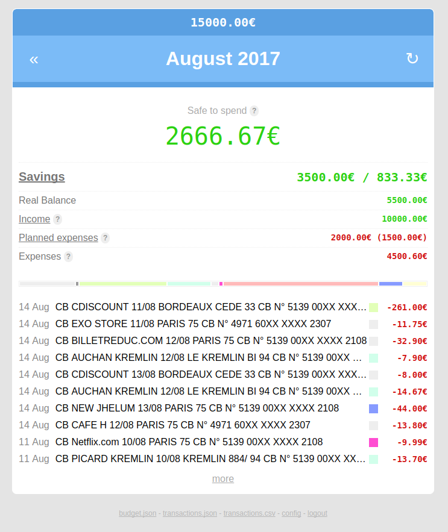

# BudgetTracker

Small budget tracking app for personal use

    $ pip install budgettracker
    $ mdkdir budget && cd budget
    $ budgettracker web

Then visit <http://localhost:5000> and start tracking your finances. Click on the &#8635; icon to upload a [CSV file](#structure-of-csv-files-to-import).  
Also has a CLI interface (see below)

**Note**: I made this small app according to my own budgeting method and it does not account for many financial/budgeting practices.

## Features

### Basic:

 - Easy to install & use, fast, no database, no setup, mobile compatible
 - Storage is flat files (CSV or JSON) which can be easily edited by hand or backed up
 - Transactions and accounts cannot be edited and must be synchronized from an external source
 - External sources can be files or web services (currently supports: CSV, OFX, bankin.com)
 - Categorize transactions
 - Categories can have warning threshold and colors
 - Support for auto-adding transactions to categories via keyword matching
 - Keep track of income, expenses and savings
 - Notifications for low amounts and categories warning threshold
 - Stats page for the whole year and for each category (**TIP:** click on the year in the header)
 
### Income sources

Define your monhtly income sources to make calculations accurate. As salaries are paid at the end of the month (in France), the income will not be detected until the end which would render all statistics useless until the end of the month. The system also allows you to define an income delay for salaries which are paid at the beginning of the next month.
 
### Planned expenses:

Define planned expenses and their recurrence (weekly, monthly, annually). Planned expenses are used to calculate your budget balance and to make sure you will be able to cover these expenses. Planned expenses can be auto-detected.
**Transactions marked as planned are excluded from expenses.**

Calculation:
 
    real_balance = income - expenses
    budget_balance = real_balance - planned_expenses
    
Your actual savings every month is the budget balance.

**TIP**: click on the month name in the web interface to see budget balances across the year

### Budget goals

You can define budget goals to save money towards something. Goals cannot be recurring. Savings will be dispatched equally amongst goals until they reach their target. You can mark transactions that use money from a goal.

You can view how your savings is used by goals using the following command:

    $ budgettracker analyze_savings
    
**TIP**: click on the year at the top of the web interface to see status of budget goals
    
### Safe to spend amount

For the current month, a safe to spend amount will be shown. Calculation is as follow:

    savings_goal = sum_of(budget_goal_amounts) / 12
    safe_to_spend = budget_balance - savings_goal

A safe accounts balance is also calculated:

    remaining_planned_expenses = sum_since_beginning_of_year_of(expected_planned_expenses - detected_planned_expenses)
    safe_accounts_balance = accounts_balance - remaining_planned_expenses
    
## Structure of CSV files to import

No headers, expected columns:

 - id
 - label
 - date as YYYY-MM-DD
 - amount
 - account number
    
## Configuration

You can create a YAML configuration file to adjust some parameters. One will be automatically created if you edit income sources, planned expenses, budget goals or categories from the web interface.

| Key | Description |
| --- | --- |
|bank_adapter|Name of the adapter to use to update the data|
|amount_format|Format for amounts (default: `{sign}${amount}`)|
|inter_account_labels_in|Regexp to match incoming transfer|
|inter_account_labels_out|Regexp to match outgoing transfer|
|notify_adapter|email|
|notify_host|smtp.gmail.com:587|
|notify_tls|true|
|notify_username|you@gmail.com|
|notify_password|PASSWORD|
|notify_emails|Array of emails to notify|
|notify_balance|Amount under which to notify|
|notify_delta|Delta between 2 notifications|
|income_delay|Number of days to look into the following months for income|
|storage|Storage adapter (csv or json)|
|storage_dir|Directory where to store data files|
|imports_dir|Directory where to store uploaded files (if not provided, do not store files)|
|web_passcode|Password protect web interface|

## CLI

Show budget:

    $ budgettracker show [month] [year]
    
Where month can be the number of the month

Update:

    $ budgettracker update [filename]
    
